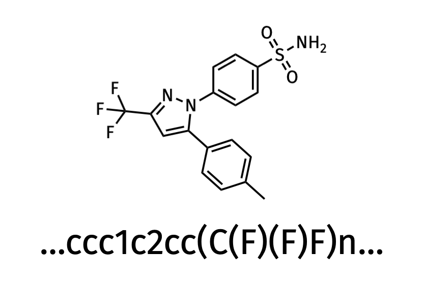
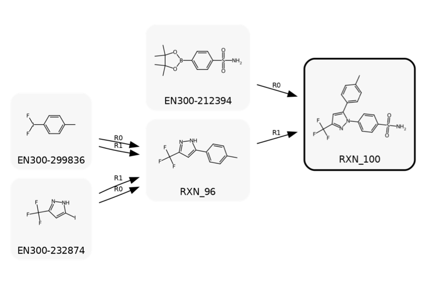
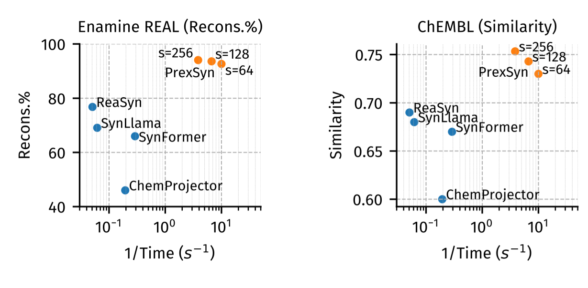
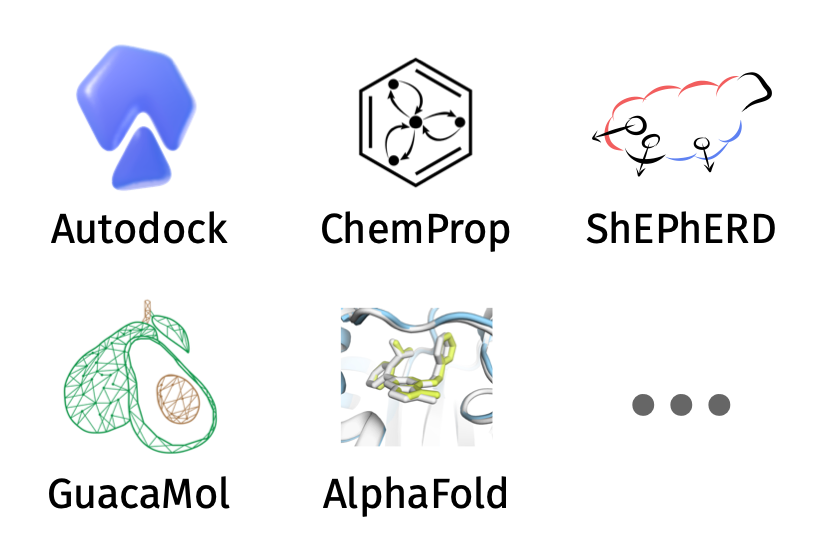
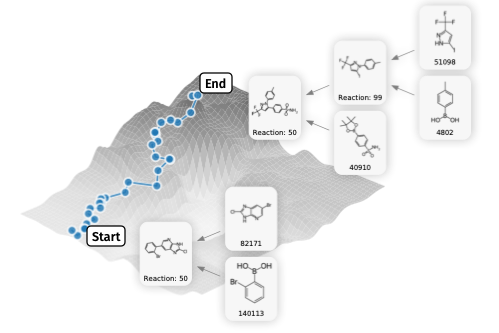
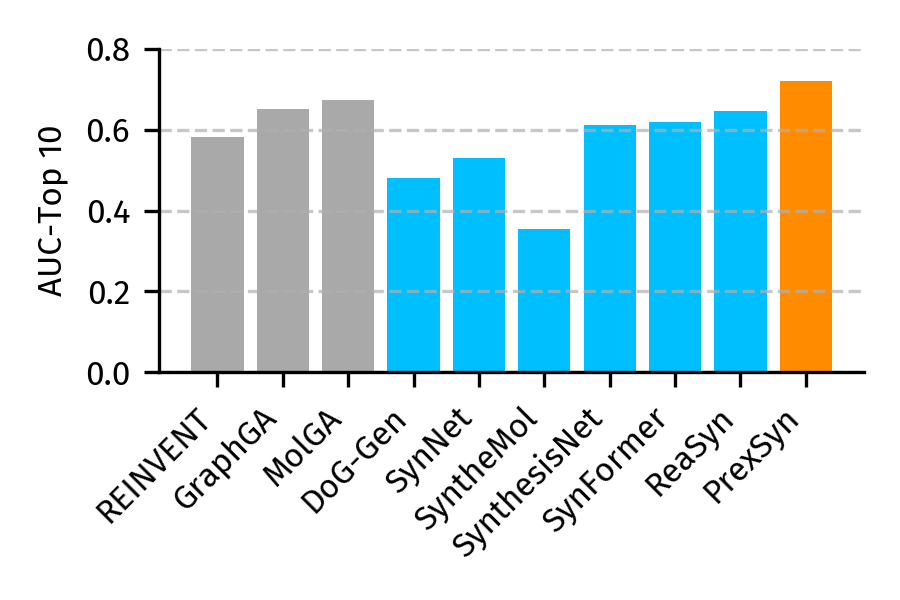

# PrexSyn

[](https://arxiv.org/abs/2512.00384)
[](https://prexsyn.readthedocs.io)
[](https://huggingface.co/datasets/luost26/prexsyn-data/tree/main)

PrexSyn is an efficient, accurate, and programmable framework for exploring synthesizable chemical space.

PrexSyn is based on a decoder-only transformer architecture that autoregressively generates [*postfix notations of
synthesis*](https://arxiv.org/abs/2406.04628) (a molecular representation based on chemical reactions and purchasable building blocks) conditioned on molecular descriptors.


PrexSyn is trained on a billion-scale datastream of postfix notations paired with molecular descriptors using only two GPUs and 32 CPU cores in two days. This is made possible by [PrexSyn Engine](https://github.com/luost26/prexsyn-engine), a real-time, high-throughput C++-based data generation pipeline.


[[Documentation]](https://prexsyn.readthedocs.io)
[[Paper]](https://arxiv.org/abs/2512.00384)
[[PrexSyn Engine]](https://github.com/luost26/prexsyn-engine)
[[Data and Model Weights]](https://huggingface.co/datasets/luost26/prexsyn-data/tree/main)

## 🚧 This is the working branch for PrexSyn v1

We are currently in the process of refactoring the main PrexSyn codebase. This effort focuses on (1) integrating the new [PrexSyn Engine](https://github.com/luost26/prexsyn-engine) v1 to improve stability and usability, (2) providing a more robust and user-friendly interface for molecular sampling with arbitrary user-defined objective functions, and (3) enabling customization of user-defined chemical spaces.

The work is expected to be completed in the next few days. Please stay tuned!

If you need to use the legacy version of PrexSyn (v0), please switch to the [`dev-v0`](https://github.com/luost26/prexsyn/tree/dev-v0) branch.

## Capabilities

| Capability | Input | Output | Performance |
| :---: | :---: | :---: | :---: |
| **Chemical space projection** |  <br/> Graph/SMILES |  <br/> Synthesis routes |  |
| **Fingerprint/descriptor based generation** |  <br/> Fingerprint/descriptor |  <br/> Synthesis routes |  |
| **Molecular sampling** |  <br/> Scoring functions |  <br/> Synthesis routes |  |


## Usage

Please refer to the [documentation](https://prexsyn.readthedocs.io) for detailed usage instructions on installation, data setup, reproducibility, and customization.

## Citation

```bibtex
@article{luo2025prexsyn,
  title   = {Efficient and Programmable Exploration of Synthesizable Chemical Space},
  author  = {Shitong Luo and Connor W. Coley},
  year    = {2025},
  journal = {arXiv preprint arXiv: 2512.00384}
}
```
