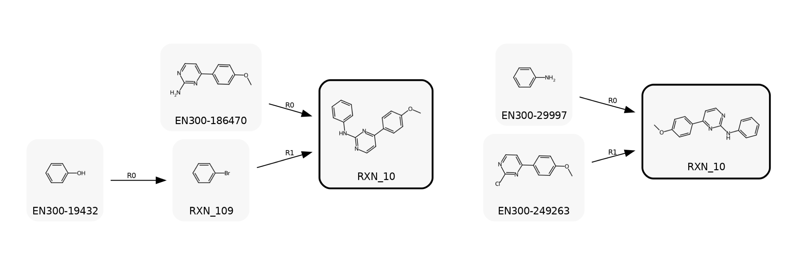

# Quick Examples

## Chemical Space Projection

An example script for chemical space projection is available at [`scripts/examples/projection.py`](https://github.com/luost26/PrexSyn/blob/main/scripts/examples/projection.py).
This script takes a SMILES string as input and generates synthesizable analogs. Top 10 results are displayed in YAML format, and optionally the synthesis pathways can be visualized as images.

```bash
python scripts/examples/projection.py --smiles "COc1ccc(-c2ccnc(Nc3ccccc3)n2)cc1"
```

The output will show the top 10 synthesizable analogs similar to the input molecule along with their synthesis pathways.

```
[2025-12-02 10:56:20.399] [prexsyn_engine] [info] Loading building blocks from cache: data/chemical_spaces/enamine_rxn115/primary_building_blocks
[2025-12-02 10:56:23.609] [prexsyn_engine] [info] BuildingBlockList: 223243 building blocks loaded from cache
[2025-12-02 10:56:43.437] [prexsyn_engine] [info] ReactionList: Loading reactions from cache data/chemical_spaces/enamine_rxn115/reactions
[2025-12-02 10:56:43.446] [prexsyn_engine] [info] ReactionList: Loaded 115 reactions
Input: COc1ccc(-c2ccnc(Nc3ccccc3)n2)cc1
Target (Canonical SMILES): COc1ccc(-c2ccnc(Nc3ccccc3)n2)cc1
Results:
- SMILES: COc1ccc(-c2ccnc(Nc3ccccc3)n2)cc1
  Similarity: 1.0000
  Synthesis:
  - Reaction Index: 103
    Possible Products:
    - COc1ccc(-c2ccnc(Nc3ccccc3)n2)cc1
    Reactants:
    - SMILES: COc1ccc(-c2ccnc(Cl)n2)cc1
      Building Block Index: 198209
      ID: EN300-249263
    - SMILES: Nc1ccccc1
      Building Block Index: 95219
      ID: EN300-29997

...
```

You can also visualize the synthesis pathways using the `--draw-output` flag:

```bash
python scripts/examples/projection.py \
    --smiles "COc1ccc(-c2ccnc(Nc3ccccc3)n2)cc1" \
    --draw-output ./draw
```

This will save the synthesis pathway diagrams in the `./draw` directory.




## Molecular Sampling

An example script for molecular sampling is available at [`scripts/examples/optim.py`](https://github.com/luost26/PrexSyn/blob/main/scripts/examples/optim.py). The oracle function in this example is the QED[^qed] (Quantitative Estimate of Drug-likeness) score from RDKit[^rdkit-qed]. You can implement your own oracle function as needed.

To run the example, use the following command:

```bash
python scripts/examples/optim.py
```

[^qed]: Quantifying the chemical beauty of drugs. [https://pmc.ncbi.nlm.nih.gov/articles/PMC3524573/](https://pmc.ncbi.nlm.nih.gov/articles/PMC3524573/)
[^rdkit-qed]: [https://www.rdkit.org/docs/source/rdkit.Chem.QED.html](https://www.rdkit.org/docs/source/rdkit.Chem.QED.html)
