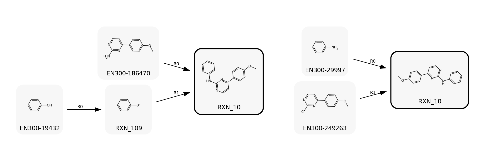

# Quick examples

## Chemical space projection

An example script for chemical space projection is available at [`scripts/examples/projection.py`](https://github.com/luost26/prexsyn/blob/main/scripts/examples/projection.py).
This script takes a SMILES string as input and generates synthesizable analogs. Top 10 results are displayed in YAML format, and optionally the synthesis pathways can be visualized as images.

```bash
uv run python scripts/examples/projection.py --smiles "COc1ccc(-c2ccnc(Nc3ccccc3)n2)cc1"
```

The output will show the top 10 synthesizable analogs similar to the input molecule along with their synthesis pathways.

```
[PrexSyn All-in-One Loader]
- Model name: Enamine US Oct 2023 + Rxn115
- Config path: data/trained_models/enamine2310_rxn115_202511.yml
- Checkpoint path: data/trained_models/enamine2310_rxn115_202511.ckpt
- Chemspace path: data/chemical_spaces/enamine2310_rxn115.chemspace
- Description:
  > Enamine Rush Delivery Building Blocks (US) Oct 2023, initially used in ChemProjector model.
  > Rxn115 (115 reactions) template set.
  > Model released in November 2025. This is the model used in the paper.

Downloading chemical space: 100%|███████████| 1.08G/1.08G [00:01<00:00, 896MB/s]
Downloading checkpoint: 100%|███████████████| 2.29G/2.29G [00:02<00:00, 773MB/s]
[2026-04-07 10:11:07.517] [prexsyn] [info] Deserializing chemical space...
[2026-04-07 10:11:07.517] [prexsyn] [info]  - Serialization version: 1
[2026-04-07 10:11:07.517] [prexsyn] [info]  - Sizes: 223243 building blocks, 115 reactions, 349117 intermediates
[2026-04-07 10:11:30.750] [prexsyn] [info]  - Building block library deserialized. Size: 223243
[2026-04-07 10:11:30.759] [prexsyn] [info]  - Reaction library deserialized. Size: 115
[2026-04-07 10:12:06.338] [prexsyn] [info]  - Intermediate library deserialized. Size: 349117
[2026-04-07 10:12:06.448] [prexsyn] [info]  - Reactant-building block mapping deserialized. Matches: 4509428
[2026-04-07 10:12:06.617] [prexsyn] [info]  - Reactant-intermediate mapping deserialized. Matches: 8821093
- Target: COc1ccc(-c2ccnc(Nc3ccccc3)n2)cc1
  Similarity: 1.0
  SMILES: COc1ccc(-c2ccnc(Nc3ccccc3)n2)cc1
  Reaction: RXN_104
  Precursors:
  - R0:
      SMILES: Brc1ccccc1
      BuildingBlock: EN300-19359
    R1:
      SMILES: COc1ccc(-c2ccnc(N)n2)cc1
      BuildingBlock: EN300-186470

...
```

You can also visualize the synthesis pathways using the `--draw-output-dir` flag. [Graphviz](https://graphviz.org/) is required for rendering the synthesis diagrams.

```bash
uv run python scripts/examples/projection.py \
    --smiles "COc1ccc(-c2ccnc(Nc3ccccc3)n2)cc1" \
    --draw-output-dir ./draw
```

This will save the synthesis pathway diagrams in the `./draw` directory.




## Molecular sampling

Coming soon...