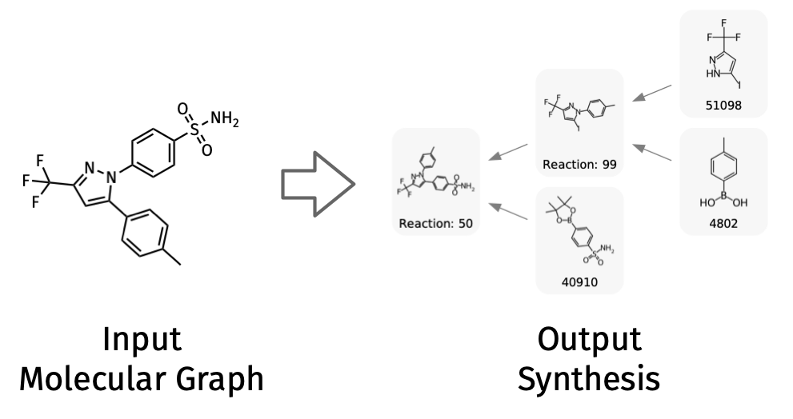
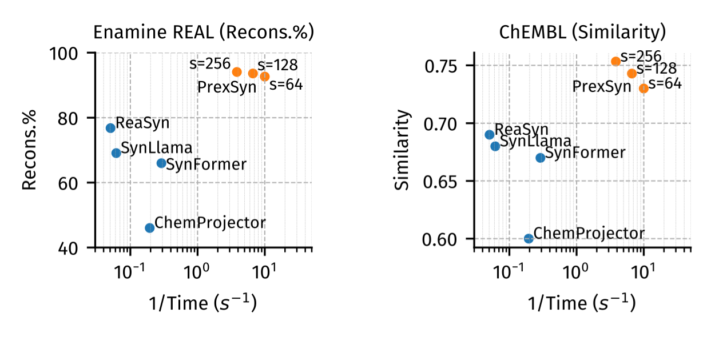
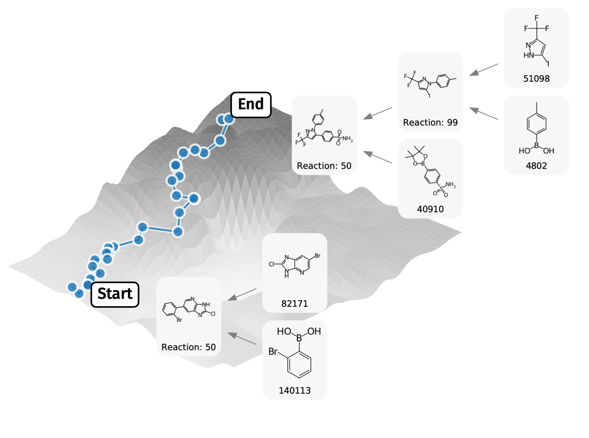

# PrexSyn

## Introduction

PrexSyn is an efficient, accurate, and programmable framework for synthesizable molecular design.
It is based on a decoder-only transformer architecture that autoregressively generates *postfix notations of
synthesis*[^postfix] (a molecular representation based on chemical reactions and purchasable building blocks) conditioned on molecular properties.

[^postfix]: Projecting Molecules into Synthesizable Chemical Spaces. [https://arxiv.org/abs/2406.04628](https://arxiv.org/abs/2406.04628)

We trained PrexSyn on a billion-scale datastream of postfix notations paired with molecular properties using only two GPUs and 32 CPU cores in two days. This is made possible by [PrexSyn Engine](https://github.com/luost26/prexsyn-engine), a real-time, high-throughput C++-based data generation pipeline.


## Capabilities

### Chemical Space Projection

Chemical space projection refers to finding synthesizable molecules similar to a given target molecule in the predefined chemical space.

{: width="300" }
/// caption
///

PrexSyn can project molecules into synthesizable chemical spaces much more efficiently and accurately than prior methods.

{: width="500" }
/// caption
///

We provide a quick demo of chemical space projection using PrexSyn. You can find the instructions [here](getting-started/examples.md).

### Molecular Sampling

{: width="350" }
/// caption
///


## Resources

### Repositories

- **PrexSyn**: [https://github.com/luost26/PrexSyn](https://github.com/luost26/PrexSyn)
- **PrexSyn Engine**: The C++ backend that provides a high-throughput training data pipeline and a fast synthesis detokenizer. [https://github.com/luost26/prexsyn-engine](https://github.com/luost26/prexsyn-engine)
- **Hugging Face Repository**: Preprocessed chemical space data and trained model weights. [https://huggingface.co/datasets/luost26/prexsyn-data/tree/main](https://huggingface.co/datasets/luost26/prexsyn-data/tree/main)

### Papers and Documentation

- **PrexSyn Paper**: Efficient and Programmable Exploration of Synthesizable Chemical Space. [https://arxiv.org/abs/2512.00384](https://arxiv.org/abs/2512.00384)
- **PrexSyn Documentation**: [https://prexsyn.readthedocs.io](https://prexsyn.readthedocs.io)
- **ChemProjector Paper**: Projecting Molecules into Synthesizable Chemical Spaces. [https://arxiv.org/abs/2406.04628](https://arxiv.org/abs/2406.04628)
- **SynFormer Paper**: Generative Artificial Intelligence for Navigating Synthesizable Chemical Space. [https://arxiv.org/abs/2410.03494](https://arxiv.org/abs/2410.03494)
- **SynNet Paper**: Amortized Tree Generation for Bottom-up Synthesis Planning and Synthesizable Molecular Design. [https://arxiv.org/abs/2110.06389](https://arxiv.org/abs/2110.06389)

### Miscellaneous

- **MIT Coley Research Group**: [https://coley.mit.edu/](https://coley.mit.edu/)

## Citation

```bibtex
@article{luo2025prexsyn,
  title   = {Efficient and Programmable Exploration of Synthesizable Chemical Space},
  author  = {Shitong Luo and Connor W. Coley},
  year    = {2025},
  journal = {arXiv preprint arXiv: 2512.00384}
}
```
